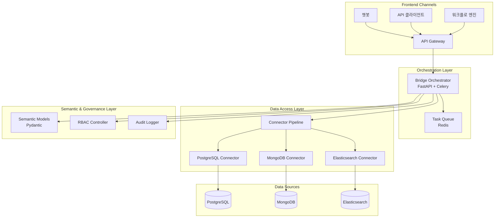

# Bridge

[](https://www.python.org/downloads/release/python-3110/)
[](https://fastapi.tiangolo.com/)
[](https://opensource.org/licenses/MIT)

## Model Context Protocol(MCP) 기반의 데이터 통합 및 AI 오케스트레이션 시스템

Bridge는 다양한 데이터 소스(PostgreSQL, MongoDB, Elasticsearch 등)에 대한 표준화된 접근을 제공하고, AI 에이전트가 엔터프라이즈 데이터를 안전하고 투명하게 활용할 수 있도록 지원합니다.

## 🚀 주요 기능

### 🔌 다중 데이터 소스 지원

- **PostgreSQL 커넥터**: 관계형 데이터베이스 지원
- **MySQL 커넥터**: MySQL 데이터베이스 지원  
- **MongoDB 커넥터**: NoSQL 문서 데이터베이스 지원
- **Elasticsearch 커넥터**: 검색 및 분석 엔진 지원
- **Mock 커넥터**: 테스트 및 개발용 모의 데이터 소스

각 커넥터는 다음 기능을 제공합니다:

- 스키마 탐색 및 프로파일링 (데이터 타입, 기본 키, 갱신 주기)
- 정책 기반 자격 증명 저장 및 로테이션
- 필터와 집계를 푸시다운하여 데이터 이그레스 최소화
- 원본이 임의 탐색을 허용하지 않을 때를 위한 선택적 캐싱 또는 스냅샷

### 🤖 AI 오케스트레이션

- **LangChain과 OpenAI SDK 통합**: 지능형 데이터 분석
- 사용자 의도를 구조화된 작업(쿼리, 변환, 요약)으로 변환
- 최적의 실행 플랜 선정 (SQL 직접 실행, Databricks 잡, Elasticsearch 쿼리, Python UDF 등)
- 중간 결과를 병합하고 MCP 컨텍스트로 재패키징
- 비용, 지연, 품질 지표를 추적하여 지속적으로 개선

### 📊 고급 분석 도구

- **통계 분석**: 기술 통계, 분포 분석, 상관관계 분석
- **데이터 프로파일링**: 데이터 품질 검사 및 기본 정보 수집
- **이상치 탐지**: IQR, Z-score 방법을 통한 이상치 식별
- **차트 생성**: 막대, 선, 산점도, 히스토그램, 박스 플롯, 히트맵 생성
- **품질 검사**: 결측값, 이상치, 일관성 검사
- **리포트 생성**: 종합 분석 리포트 및 대시보드 생성

### 🤖 머신러닝 및 AI

- **시계열 분석**: ARIMA, Prophet, LSTM을 활용한 시계열 예측
- **클러스터링**: K-means, DBSCAN, 계층적 클러스터링
- **이상치 탐지**: Isolation Forest, One-Class SVM을 활용한 고급 이상치 탐지
- **차원 축소**: PCA, t-SNE, UMAP을 통한 차원 축소
- **모델 관리**: 모델 레지스트리, 버전 관리, 성능 모니터링
- **모델 추론**: 실시간 및 배치 예측 서비스

### 🔗 통합 데이터 분석 레이어

- **DataUnifier**: 다중 소스 데이터를 표준 테이블 형태로 통합
- **SchemaMapper**: 스키마 매핑 및 정규화 시스템
- **TypeConverter**: 고급 데이터 타입 변환 도구
- **StreamingProcessor**: 대용량 데이터 스트리밍 처리
- **IntegratedDataLayer**: 통합 데이터 분석 레이어 메인 클래스
- **MCP 도구 확장**: data_unifier, schema_mapper, type_converter, streaming_processor, integrated_data_layer

### 📊 고급 통계 분석 및 시각화

- **AdvancedStatistics**: 고급 통계 분석 모듈 (기술 통계, 상관관계, 분포 분석)
- **AdvancedVisualization**: 인터랙티브 차트 및 시각화 모듈
- **StatisticalTests**: 통계적 검정 모듈 (가설검정, A/B 테스트, 회귀분석)
- **TimeSeriesAnalysis**: 시계열 분석 및 예측 모듈
- **MCP 도구 확장**: advanced_statistics, interactive_charts, statistical_tests, time_series_analysis

### 🔍 데이터 품질 관리 시스템

- **ComprehensiveQualityMetrics**: 종합 품질 메트릭 계산 (완전성, 정확성, 일관성, 유효성)
- **AdvancedOutlierDetector**: 고급 이상치 탐지 (Isolation Forest, LOF, One-Class SVM)
- **DataCleaningPipeline**: 자동화된 데이터 정제 파이프라인
- **QualityTrendAnalyzer**: 품질 트렌드 분석 및 예측
- **MCP 도구 확장**: comprehensive_quality_metrics, advanced_outlier_detection, data_cleaning_pipeline, quality_trend_analysis, set_quality_thresholds

### ⚙️ 워크플로 및 자동화 시스템

- **AnalysisTemplateManager**: 분석 템플릿 관리 시스템
- **CustomerAnalysisTemplate**: 고객 분석 템플릿 (RFM 분석, 세그멘테이션)
- **SalesAnalysisTemplate**: 매출 분석 템플릿 (트렌드, 계절성 분석)
- **ABTestAnalysisTemplate**: A/B 테스트 분석 템플릿 (통계적 유의성 검정)
- **WorkflowAutomationTools**: 워크플로 자동화 및 DAG 생성
- **MCP 도구 확장**: execute_analysis_template, list_analysis_templates, get_template_info, validate_data_for_template, create_workflow_dag, optimize_workflow_performance

### 🔒 엔터프라이즈 보안

- **RBAC (역할 기반 접근 제어)**: 프로젝트, 커넥터, 데이터셋에 대한 세밀한 권한 관리
- **데이터 마스킹**: 민감한 컬럼 보호를 위한 쿼리 리라이팅 및 데이터 마스킹
- **감사 로깅**: 모든 활동 추적 및 구조화된 JSON 로그 저장
- **API 키 인증**: FastAPI 의존성 주입을 통한 안전한 API 접근
- **SQL 인젝션 방지**: 파라미터 바인딩을 통한 안전한 쿼리 실행

### 📊 시맨틱 모델링

- **Pydantic 기반 데이터 계약**: 구조화된 데이터 모델 정의
- **비즈니스 정의와 민감도 태그**: 논리 엔터티(테이블, 세그먼트, 피처) 노출
- **자동 프로파일링**: 스키마를 자동 프로파일링하고 시맨틱 태그 생성

### ⚡ 비동기 처리

- **FastAPI + Celery**: 고성능 워크플로 처리
- **Redis 브로커**: 비동기 작업 큐 관리
- **실시간 상태 추적**: 작업 진행 상황 모니터링

### 📈 관측성 및 모니터링

- **OpenTelemetry 통합**: 분산 추적 및 메트릭 수집
- **Prometheus + Grafana**: 성능 모니터링 및 대시보드
- **구조화된 로깅**: JSON 형식 로그 저장
- **에러 추적**: Sentry 통합을 통한 에러 모니터링

## 🏗️ 아키텍처



## 📁 프로젝트 구조

```text
src/bridge/
├── connectors/          # 데이터 소스 커넥터
│   ├── base.py         # BaseConnector 추상 클래스
│   ├── postgres.py     # PostgreSQL 커넥터
│   ├── mock.py         # Mock 커넥터 (테스트용)
│   └── registry.py     # 커넥터 레지스트리
├── orchestrator/        # FastAPI 오케스트레이터
│   ├── app.py          # FastAPI 애플리케이션
│   ├── routers.py      # API 라우터
│   ├── tasks.py        # Celery 태스크
│   ├── celery_app.py   # Celery 설정
│   └── queries.py      # Celery 결과 조회 유틸리티
├── semantic/           # 시맨틱 모델
│   └── models.py       # Pydantic 데이터 모델
├── workspaces/         # 워크스페이스 관리
│   └── rbac.py         # RBAC 시스템
├── audit/              # 감사 로깅
│   └── logger.py       # 감사 로거
├── analytics/          # 분석 도구
│   ├── core/           # 핵심 분석 기능
│   │   ├── data_unifier.py        # 데이터 통합
│   │   ├── schema_mapper.py       # 스키마 매핑
│   │   ├── type_converter.py      # 타입 변환
│   │   ├── streaming_processor.py # 스트리밍 처리
│   │   ├── integrated_data_layer.py # 통합 데이터 레이어
│   │   ├── advanced_statistics.py # 고급 통계 분석
│   │   ├── advanced_visualization.py # 고급 시각화
│   │   ├── statistical_tests.py   # 통계적 검정
│   │   └── time_series_analysis.py # 시계열 분석
│   ├── quality/        # 데이터 품질 관리
│   │   ├── comprehensive_metrics.py # 종합 품질 메트릭
│   │   ├── advanced_outlier_detection.py # 고급 이상치 탐지
│   │   ├── data_cleaning_pipeline.py # 데이터 정제 파이프라인
│   │   └── quality_trend_analysis.py # 품질 트렌드 분석
│   ├── workflows/      # 워크플로 및 자동화
│   │   └── analysis_templates.py  # 분석 템플릿 시스템
│   ├── mcp_tools/      # MCP 도구
│   │   ├── quality_management_tools.py # 품질 관리 도구
│   │   └── workflow_automation_tools.py # 워크플로 자동화 도구
│   └── utils/          # 분석 유틸리티
├── ml/                 # 머신러닝 모듈
│   ├── algorithms/     # ML 알고리즘
│   │   ├── time_series.py      # 시계열 분석
│   │   ├── anomaly_detection.py # 이상치 탐지
│   │   ├── clustering.py       # 클러스터링
│   │   └── dimensionality_reduction.py # 차원 축소
│   ├── models/         # 모델 관리
│   │   ├── registry.py         # 모델 레지스트리
│   │   ├── inference.py        # 모델 추론
│   │   └── versioning.py       # 모델 버전 관리
│   └── pipelines/      # ML 파이프라인
├── governance/         # 데이터 거버넌스
│   └── contracts.py    # 데이터 계약 관리
└── cli.py              # CLI 인터페이스
```

## 🛠️ 빠른 시작

### 1. 의존성 설치

```bash
# 가상환경 생성 및 의존성 설치
make install
```

### 2. 코드 포맷팅

```bash
# 코드 스타일 검사 및 포맷팅
make fmt
```

### 3. 테스트 실행

```bash
# 단위 테스트 실행
make test

# 커버리지 포함 테스트
make test -- --cov
```

### 4. 개발 서버 실행

```bash
# FastAPI 개발 서버 실행
make dev
```

### 5. Celery 워커 실행 (선택사항)

```bash
# 백그라운드 작업 처리를 위한 Celery 워커 실행
make worker
```

### 6. Docker Compose 개발 환경 (선택사항)

```bash
# Redis와 함께 전체 개발 환경 실행
docker-compose -f docker-compose.dev.yml up -d

# 테스트 실행
docker-compose -f docker-compose.dev.yml run --rm test
```

서버가 실행되면 [http://localhost:8000](http://localhost:8000)에서 API에 접근할 수 있습니다.

### 7. MCP 서버 실행 (선택사항)

Bridge MCP는 환경 변수로 제어되는 다양한 실행 모드를 지원합니다:

- **`development`**: 모의 응답을 사용한 개발 모드
- **`production`**: 실제 DB + 에러 복구 기능
- **`real`**: 실제 데이터베이스 직접 연동
- **`mock`**: 모의 응답 + 직접 JSON-RPC

```bash
# 통합 서버 실행 (권장)
make mcp-server
python -m bridge.mcp_server_unified

# 환경 변수로 모드 지정
BRIDGE_MCP_MODE=development python -m bridge.mcp_server_unified
BRIDGE_MCP_MODE=production python -m bridge.mcp_server_unified
BRIDGE_MCP_MODE=real python -m bridge.mcp_server_unified
BRIDGE_MCP_MODE=mock python -m bridge.mcp_server_unified

# 개별 서버 실행 (개발/테스트용)
bridge-mcp
bridge-mcp-real
python -m bridge.mcp_server_robust
python -m bridge.mcp_server_real
python -m bridge.mcp_server_working
python -m bridge.mcp_server_minimal
python -m bridge.mcp_server_simple
python -m bridge.mcp_server_fixed

# 스크립트 파일을 통한 실행
python scripts/run_mcp_server.py
```

### 8. CLI로 작업 제출 및 상태 폴링 (선택사항)

```bash
python cli.py "지역별 이탈 위험 분석" --sources mock --tools sql_executor
```

출력 예:

```text
작업이 제출되었습니다. job_id=2f7c18af-...
[STATUS 202] {"job_id": "2f7c18af-...", "state": "PENDING", "ready": false, ...}
[STATUS 200] {"job_id": "2f7c18af-...", "state": "SUCCESS", "ready": true, "successful": true, ...}
[SUCCESS] 작업이 완료되었습니다.
```

### 9. ML 모델 사용 예시 (선택사항)

```python
# 시계열 분석
from bridge.ml.algorithms.time_series import TimeSeriesAnalyzer

analyzer = TimeSeriesAnalyzer()
result = analyzer.fit_arima(data, order=(1, 1, 1))
forecast = analyzer.forecast(result, periods=30)

# 모델 관리
from bridge.ml.models.registry import ModelRegistry

registry = ModelRegistry()
model = registry.get_model("churn_model_001")
predictions = registry.predict(model.id, test_data)
```

### 10. 통합 데이터 분석 레이어 사용 예시 (선택사항)

```python
# 통합 데이터 분석 레이어
from bridge.analytics.core import IntegratedDataLayer

# 통합 레이어 초기화
layer = IntegratedDataLayer(chunk_size=10000, memory_limit_mb=1000)

# 다중 소스 데이터 통합
data_sources = {
    "postgres": postgres_data,
    "mongodb": mongo_data,
    "elasticsearch": es_data
}

unified_data = layer.integrate_data_sources(
    data_sources=data_sources,
    merge_strategy="union",
    enable_streaming=True
)

# 데이터 요약 정보
summary = layer.get_data_summary()
print(f"통합된 데이터: {summary}")
```

### 11. 고급 통계 분석 및 시각화 사용 예시 (선택사항)

```python
# 고급 통계 분석
from bridge.analytics.core import AdvancedStatistics, AdvancedVisualization

# 고급 통계 분석기 초기화
stats_analyzer = AdvancedStatistics()
viz = AdvancedVisualization()

# 기술 통계 분석
descriptive = stats_analyzer.descriptive_statistics(df, ["value1", "value2"])

# 상관관계 분석
correlation = stats_analyzer.correlation_analysis(df, ["value1", "value2"])

# 고급 차트 생성
chart = viz.create_advanced_chart(
    df, "scatter", "value1", "value2", 
    title="Value1 vs Value2 Analysis"
)

# 통계적 플롯 생성
statistical_plots = viz.create_statistical_plots(
    df, "value1", ["histogram", "qq", "box"]
)
```

## 🤖 AI 작업 템플릿

Bridge MCP는 다음과 같은 표준화된 AI 작업 패턴을 지원합니다:

| 패턴 | 목표 | 필수 입력 | 전형 출력 |
|------|------|-----------|-----------|
| 기술 통계 | 지표 요약, 추세, 이상 징후 파악 | 테이블 또는 논리 엔터티 | 내러티브 요약과 핵심 지표 |
| 세그먼트 추출 | 규칙 또는 유사도로 코호트를 식별 | 모수 엔터티, 필터 또는 특성 | 세그먼트 정의와 내보내기 핸들 |
| 유사도 비교 | 엔터티 또는 행동 간 유사도 측정 | 피처 벡터, 유사도 지표 | 상위 순위 목록과 설명 토큰 |
| 맞춤형 분석 | 도구를 조합한 다단계 워크플로 구성 | 프롬프트, 선택적 코드 템플릿 | 노트북 셀, 대시보드, API 응답 |

템플릿은 버전 관리되고 파라미터화되어 승인된 로직을 고정하면서도 AI 기반 탐색을 허용합니다.

## 📚 API 사용 예시

### 작업 계획 요청

```bash
curl -X POST "http://localhost:8000/tasks/plan" \
  -H "Content-Type: application/json" \
  -H "Authorization: Bearer YOUR_API_KEY" \
  -d '{
    "intent": "고객 세그먼트 분석",
    "sources": ["postgres://analytics_db"],
    "required_tools": ["sql_executor"],
    "context": {
      "time_range": "2024-01-01 to 2024-12-31"
    }
  }'
```

### 작업 상태 조회

```bash
# 작업 ID로 상태 조회
curl -H "Authorization: Bearer YOUR_API_KEY" "http://localhost:8000/tasks/{job_id}"

# 202 응답 예시 (큐에 대기 중)
{
  "job_id": "2f7c18af-...",
  "state": "PENDING",
  "ready": false,
  "successful": false
}

# 200 응답 예시 (성공)
{
  "job_id": "2f7c18af-...",
  "state": "SUCCESS",
  "ready": true,
  "successful": true,
  "result": {...}
}

# 200 응답 예시 (실패)
{
  "job_id": "2f7c18af-...",
  "state": "FAILURE",
  "ready": true,
  "successful": false,
  "error": "에러 메시지"
}
```

### CLI 사용법

```bash
# 기본 사용법
python cli.py "고객 세그먼트 분석"

# 특정 데이터 소스와 도구 지정
python cli.py "프리미엄 고객 분석" --sources postgres://analytics_db --tools sql_executor,statistics_analyzer

# 다른 서버 URL 지정
python cli.py "데이터 분석" --base-url http://staging.example.com:8000

# 폴링 간격 조정
python cli.py "분석 작업" --poll-interval 5.0
```

### 헬스 체크

```bash
curl "http://localhost:8000/health"
```

## 🔧 개발 가이드

### 새로운 커넥터 추가

```python
from src.bridge.connectors.base import BaseConnector

class MyDatabaseConnector(BaseConnector):
    async def test_connection(self) -> bool:
        # 연결 테스트 로직
        return True
    
    async def get_metadata(self) -> Dict[str, Any]:
        # 메타데이터 수집 로직
        return {"tables": []}
    
    async def run_query(self, query: str, params: Dict[str, Any] = None):
        # 쿼리 실행 로직
        yield {}
```

### 새로운 API 엔드포인트 추가

```python
from fastapi import APIRouter
from ..semantic.models import TaskRequest, TaskResponse

router = APIRouter()

@router.post("/my-endpoint", response_model=TaskResponse)
async def my_endpoint(request: TaskRequest) -> TaskResponse:
    # 엔드포인트 로직
    return TaskResponse(...)
```

## 🔒 보안 기능

- **API 키 인증**: FastAPI 의존성 주입을 통한 안전한 API 접근
- **SQL 인젝션 방지**: 파라미터 바인딩을 통한 안전한 쿼리 실행
- **입력 검증**: Pydantic 모델을 통한 엄격한 데이터 검증
- **데이터 마스킹**: 민감한 컬럼 자동 마스킹
- **RBAC**: 역할 기반 접근 제어
- **감사 로깅**: 모든 활동 추적 및 구조화된 로그 저장
- **에러 처리**: 안전한 예외 처리 및 로깅

## 📈 모니터링

- **구조화된 로그**: JSON 형식 로그 저장
- **메트릭 수집**: 성능 및 에러 모니터링
- **감사 추적**: 컴플라이언스 지원

## 🧪 테스트

```bash
# 전체 테스트 실행
make test

# 특정 모듈 테스트
pytest tests/connectors/test_postgres_connector.py

# 커버리지 리포트 생성
make test -- --cov=src --cov-report=html

# Redis 통합 테스트
export BRIDGE_TEST_REDIS_URL=redis://localhost:6379/2
make test

# Docker Compose를 통한 테스트
docker-compose -f docker-compose.dev.yml run --rm test
```

## 📖 문서

### 사용자 가이드
- [사용자 가이드](docs/user-guide.md) - 각 기능별 상세한 사용 방법
- [ML 사용 가이드](docs/ml-user-guide.md) - 머신러닝 기능 사용법
- [통합 데이터 분석 가이드](docs/integrated-data-layer-guide.md) - 통합 데이터 분석 레이어 사용법
- [고급 통계 분석 가이드](docs/advanced-analytics-guide.md) - 고급 통계 분석 및 시각화 사용법
- [API 참조 문서](docs/api-reference.md) - REST API 완전 참조
- [MCP 설치 및 사용 가이드](docs/mcp-installation-guide.md) - MCP 서버 설치 및 클라이언트 연결 방법

### 개발자 가이드
- [개발자 가이드](docs/developer-guide.md) - 개발 환경 설정 및 기여 방법
- [아키텍처 문서](docs/architecture.md) - 시스템 아키텍처 및 설계
- [보안 가이드](docs/security-guide.md) - 보안 정책 및 구현 방법
- [성능 튜닝 가이드](docs/performance-tuning.md) - 성능 최적화 방법

### 기술 문서
- [개발자 빠른 시작 가이드](docs/developer-quick-start.md)
- [시스템 아키텍처](docs/bridge-system-architecture.md)
- [MCP 사양](docs/bridge-model-context-protocol.md)
- [Python 아키텍처 가이드](docs/python-architecture-tech-stack.md)
- [MCP 서버 구현 계획](docs/mcp-server-implementation.md)

## 🌉 Bridge MCP의 가치

Bridge MCP는 **엔터프라이즈 데이터를 AI와 연결하는 다리** 역할을 하며, 다음과 같은 가치를 제공합니다:

### 🎯 핵심 목적

- **표준화된 데이터 접근**: 다양한 데이터 소스에 대한 일관된 접근 방식
- **AI 친화적 인터페이스**: AI 에이전트가 쉽게 활용할 수 있는 표준화된 프로토콜
- **엔터프라이즈급 보안**: 데이터 거버넌스와 컴플라이언스 지원
- **확장 가능한 아키텍처**: 모듈화된 설계로 쉬운 확장과 유지보수

### 💡 주요 이점

1. **데이터 복제 없이 통합**: 경직된 ETL 파이프라인을 강제하지 않고 엔터프라이즈 데이터 접근 통합
2. **예측 가능한 AI 추론**: 감사 가능한 재사용형 컨텍스트 패키지 제공
3. **안내형 워크플로**: 통계, 세그먼트 추출, 유사도 분석, 맞춤형 분석을 위한 구조화된 워크플로
4. **데이터 거버넌스**: 소스 수준 권한, 마스킹, 가시성을 적용하여 데이터 보안 보장

## 🚀 다음 단계

1. **커넥터 확장**: MongoDB, PostgreSQL 커넥터 구현 완료
2. **AI 통합**: LangChain, OpenAI SDK 통합 완료
3. **MCP 서버**: 1개 통합 서버 + 7개 개별 서버 구현 완료
4. **ML 기능**: 시계열 분석, 모델 관리, 거버넌스 계약 구현 완료
5. **통합 데이터 분석 레이어**: CA 마일스톤 3.1 구현 완료
6. **고급 통계 분석 및 시각화**: CA 마일스톤 3.2 구현 완료
5. **모니터링**: Prometheus, Grafana 대시보드 구축
6. **테스트**: 단위/통합 테스트 확장
7. **문서화**: API 문서 자동 생성

## 🤝 기여하기

1. 이슈 생성 또는 기존 이슈 확인
2. 기능 브랜치 생성 (`git checkout -b feature/amazing-feature`)
3. 코드 작성 및 테스트
4. 커밋 (`git commit -m 'feat: add amazing feature'`)
5. 푸시 (`git push origin feature/amazing-feature`)
6. Pull Request 생성

### 커밋 메시지 규칙

- `feat`: 새로운 기능
- `fix`: 버그 수정
- `docs`: 문서 변경
- `style`: 코드 포맷팅
- `refactor`: 코드 리팩토링
- `test`: 테스트 추가/수정
- `chore`: 빌드 프로세스 또는 보조 도구 변경

## 📞 지원

- **이슈 트래커**: [GitHub Issues](https://github.com/your-org/bridge/issues)
- **문서**: `/docs` 디렉토리
- **코드 예시**: `/assets/samples` 디렉토리

## 📄 라이선스

이 프로젝트는 MIT 라이선스 하에 배포됩니다. 자세한 내용은 [LICENSE](LICENSE) 파일을 참조하세요.

## 🙏 감사의 말

이 프로젝트는 다음 오픈소스 프로젝트들의 도움을 받았습니다:

- [FastAPI](https://fastapi.tiangolo.com/)
- [Pydantic](https://pydantic.dev/)
- [SQLAlchemy](https://www.sqlalchemy.org/)
- [Celery](https://docs.celeryproject.org/)
- [LangChain](https://python.langchain.com/)

---

**Bridge** - 엔터프라이즈 데이터를 AI와 연결하는 다리 🌉
