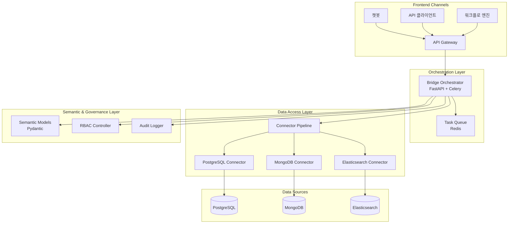

# Bridge

[](https://www.python.org/downloads/release/python-3110/)
[](https://fastapi.tiangolo.com/)
[](https://opensource.org/licenses/MIT)

**Model Context Protocol(MCP) 기반의 데이터 통합 및 AI 오케스트레이션 시스템**

Bridge는 다양한 데이터 소스(PostgreSQL, MongoDB, Elasticsearch 등)에 대한 표준화된 접근을 제공하고, AI 에이전트가 엔터프라이즈 데이터를 안전하고 투명하게 활용할 수 있도록 지원합니다.

## 🚀 주요 기능

- **🔌 다중 데이터 소스 지원**: PostgreSQL, MongoDB, Elasticsearch 등 다양한 데이터베이스 커넥터
- **🤖 AI 오케스트레이션**: LangChain과 OpenAI SDK를 활용한 지능형 데이터 분석
- **🔒 엔터프라이즈 보안**: RBAC, 데이터 마스킹, 감사 로깅
- **📊 시맨틱 모델링**: Pydantic 기반의 구조화된 데이터 계약
- **⚡ 비동기 처리**: FastAPI + Celery를 통한 고성능 워크플로 처리
- **📈 관측성**: OpenTelemetry, Prometheus, Grafana 통합

## 🏗️ 아키텍처



## 📁 프로젝트 구조

```
src/bridge/
├── connectors/          # 데이터 소스 커넥터
│   ├── base.py         # BaseConnector 추상 클래스
│   ├── postgres.py     # PostgreSQL 커넥터
│   ├── mock.py         # Mock 커넥터 (테스트용)
│   └── registry.py     # 커넥터 레지스트리
├── orchestrator/        # FastAPI 오케스트레이터
│   ├── app.py          # FastAPI 애플리케이션
│   ├── routers.py      # API 라우터
│   ├── tasks.py        # Celery 태스크
│   ├── celery_app.py   # Celery 설정
│   └── queries.py      # Celery 결과 조회 유틸리티
├── semantic/           # 시맨틱 모델
│   └── models.py       # Pydantic 데이터 모델
├── workspaces/         # 워크스페이스 관리
│   └── rbac.py         # RBAC 시스템
├── audit/              # 감사 로깅
│   └── logger.py       # 감사 로거
└── cli.py              # CLI 인터페이스
```

## 🛠️ 빠른 시작

### 1. 의존성 설치

```bash
# 가상환경 생성 및 의존성 설치
make install
```

### 2. 코드 포맷팅

```bash
# 코드 스타일 검사 및 포맷팅
make fmt
```

### 3. 테스트 실행

```bash
# 단위 테스트 실행
make test

# 커버리지 포함 테스트
make test -- --cov
```

### 4. 개발 서버 실행

```bash
# FastAPI 개발 서버 실행
make dev
```

### 5. Celery 워커 실행 (선택사항)

```bash
# 백그라운드 작업 처리를 위한 Celery 워커 실행
make worker
```

### 6. Docker Compose 개발 환경 (선택사항)

```bash
# Redis와 함께 전체 개발 환경 실행
docker-compose -f docker-compose.dev.yml up -d

# 테스트 실행
docker-compose -f docker-compose.dev.yml run --rm test
```

서버가 실행되면 [http://localhost:8000](http://localhost:8000)에서 API에 접근할 수 있습니다.

### 7. CLI로 작업 제출 및 상태 폴링 (선택사항)

```bash
python cli.py "지역별 이탈 위험 분석" --sources mock --tools sql_executor
```

출력 예:

```
작업이 제출되었습니다. job_id=2f7c18af-...
[STATUS 202] {"job_id": "2f7c18af-...", "state": "PENDING", "ready": false, ...}
[STATUS 200] {"job_id": "2f7c18af-...", "state": "SUCCESS", "ready": true, "successful": true, ...}
[SUCCESS] 작업이 완료되었습니다.
```

## 📚 API 사용 예시

### 작업 계획 요청

```bash
curl -X POST "http://localhost:8000/tasks/plan" \
  -H "Content-Type: application/json" \
  -d '{
    "intent": "고객 세그먼트 분석",
    "sources": ["postgres://analytics_db"],
    "required_tools": ["sql_executor"],
    "context": {
      "time_range": "2024-01-01 to 2024-12-31"
    }
  }'
```

### 작업 상태 조회

```bash
# 작업 ID로 상태 조회
curl "http://localhost:8000/tasks/{job_id}"

# 202 응답 예시 (큐에 대기 중)
{
  "job_id": "2f7c18af-...",
  "state": "PENDING",
  "ready": false,
  "successful": false
}

# 200 응답 예시 (성공)
{
  "job_id": "2f7c18af-...",
  "state": "SUCCESS",
  "ready": true,
  "successful": true,
  "result": {...}
}

# 200 응답 예시 (실패)
{
  "job_id": "2f7c18af-...",
  "state": "FAILURE",
  "ready": true,
  "successful": false,
  "error": "에러 메시지"
}
```

### CLI 사용법

```bash
# 기본 사용법
python cli.py "고객 세그먼트 분석"

# 특정 데이터 소스와 도구 지정
python cli.py "프리미엄 고객 분석" --sources postgres://analytics_db --tools sql_executor,statistics_analyzer

# 다른 서버 URL 지정
python cli.py "데이터 분석" --base-url http://staging.example.com:8000

# 폴링 간격 조정
python cli.py "분석 작업" --poll-interval 5.0
```

### 헬스 체크

```bash
curl "http://localhost:8000/health"
```

## 🔧 개발 가이드

### 새로운 커넥터 추가

```python
from src.bridge.connectors.base import BaseConnector

class MyDatabaseConnector(BaseConnector):
    async def test_connection(self) -> bool:
        # 연결 테스트 로직
        return True
    
    async def get_metadata(self) -> Dict[str, Any]:
        # 메타데이터 수집 로직
        return {"tables": []}
    
    async def run_query(self, query: str, params: Dict[str, Any] = None):
        # 쿼리 실행 로직
        yield {}
```

### 새로운 API 엔드포인트 추가

```python
from fastapi import APIRouter
from ..semantic.models import TaskRequest, TaskResponse

router = APIRouter()

@router.post("/my-endpoint", response_model=TaskResponse)
async def my_endpoint(request: TaskRequest) -> TaskResponse:
    # 엔드포인트 로직
    return TaskResponse(...)
```

## 🔒 보안 기능

- **데이터 마스킹**: 민감한 컬럼 자동 마스킹
- **RBAC**: 역할 기반 접근 제어
- **감사 로깅**: 모든 활동 추적
- **쿼리 리라이팅**: 데이터 보호

## 📈 모니터링

- **구조화된 로그**: JSON 형식 로그 저장
- **메트릭 수집**: 성능 및 에러 모니터링
- **감사 추적**: 컴플라이언스 지원

## 🧪 테스트

```bash
# 전체 테스트 실행
make test

# 특정 모듈 테스트
pytest tests/connectors/test_postgres_connector.py

# 커버리지 리포트 생성
make test -- --cov=src --cov-report=html

# Redis 통합 테스트
export BRIDGE_TEST_REDIS_URL=redis://localhost:6379/2
make test

# Docker Compose를 통한 테스트
docker-compose -f docker-compose.dev.yml run --rm test
```

## 📖 문서

- [개발자 빠른 시작 가이드](docs/developer-quick-start.md)
- [시스템 아키텍처](docs/bridge-system-architecture.md)
- [MCP 사양](docs/bridge-model-context-protocol.md)
- [Python 아키텍처 가이드](docs/python-architecture-tech-stack.md)
- [MCP 서버 구현 계획](docs/mcp-server-implementation.md)

## 🚀 다음 단계

1. **커넥터 확장**: MongoDB, Elasticsearch 커넥터 구현
2. **AI 통합**: LangChain, OpenAI SDK 통합
3. **모니터링**: Prometheus, Grafana 대시보드 구축
4. **테스트**: 단위/통합 테스트 확장
5. **문서화**: API 문서 자동 생성

## 🤝 기여하기

1. 이슈 생성 또는 기존 이슈 확인
2. 기능 브랜치 생성 (`git checkout -b feature/amazing-feature`)
3. 코드 작성 및 테스트
4. 커밋 (`git commit -m 'feat: add amazing feature'`)
5. 푸시 (`git push origin feature/amazing-feature`)
6. Pull Request 생성

### 커밋 메시지 규칙

- `feat`: 새로운 기능
- `fix`: 버그 수정
- `docs`: 문서 변경
- `style`: 코드 포맷팅
- `refactor`: 코드 리팩토링
- `test`: 테스트 추가/수정
- `chore`: 빌드 프로세스 또는 보조 도구 변경

## 📞 지원

- **이슈 트래커**: [GitHub Issues](https://github.com/your-org/bridge/issues)
- **문서**: `/docs` 디렉토리
- **코드 예시**: `/assets/samples` 디렉토리

## 📄 라이선스

이 프로젝트는 MIT 라이선스 하에 배포됩니다. 자세한 내용은 [LICENSE](LICENSE) 파일을 참조하세요.

## 🙏 감사의 말

이 프로젝트는 다음 오픈소스 프로젝트들의 도움을 받았습니다:

- [FastAPI](https://fastapi.tiangolo.com/)
- [Pydantic](https://pydantic.dev/)
- [SQLAlchemy](https://www.sqlalchemy.org/)
- [Celery](https://docs.celeryproject.org/)
- [LangChain](https://python.langchain.com/)

---

**Bridge** - 엔터프라이즈 데이터를 AI와 연결하는 다리 🌉
