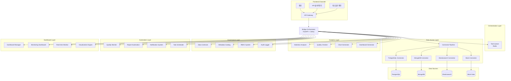
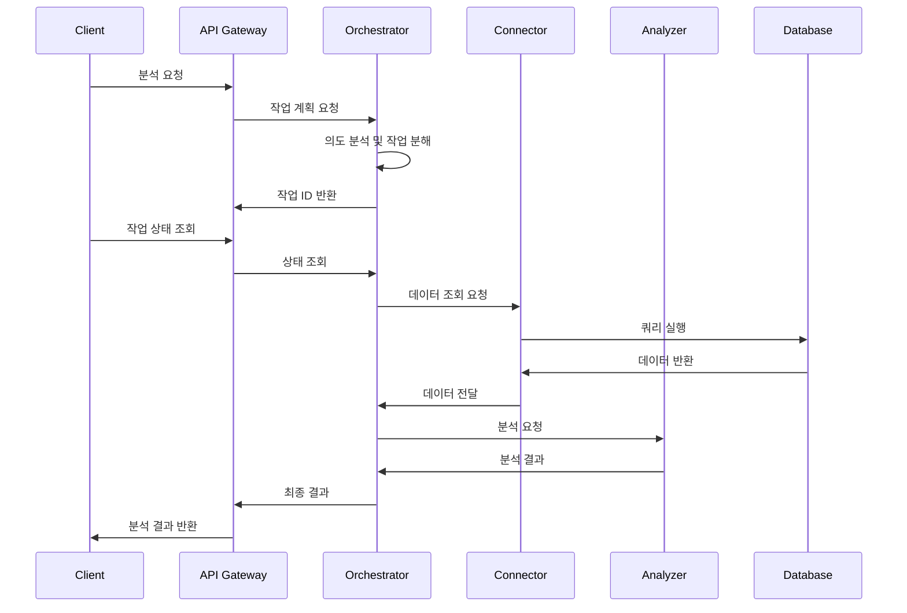
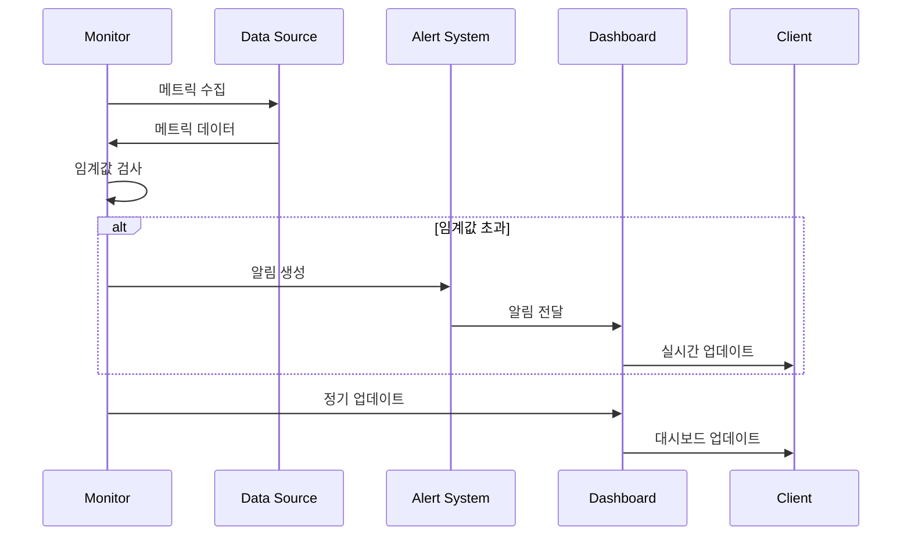
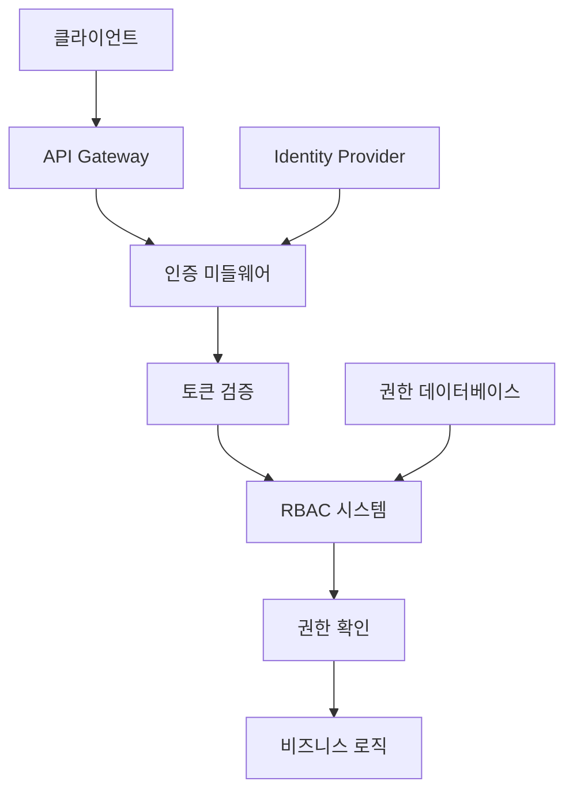

# Bridge 아키텍처 문서

## 📖 개요

Bridge는 Model Context Protocol(MCP) 기반의 데이터 통합 및 AI 오케스트레이션 시스템으로, 다양한 데이터 소스에 대한 표준화된 접근을 제공하고 AI 에이전트가 엔터프라이즈 데이터를 안전하고 투명하게 활용할 수 있도록 지원합니다.

## 🏗️ 시스템 아키텍처

### 전체 아키텍처 다이어그램



## 🔧 핵심 컴포넌트

### 1. API Gateway

**역할**: 모든 외부 요청의 진입점

**주요 기능**:
- 요청 라우팅 및 로드 밸런싱
- 인증 및 권한 검사
- 요청/응답 변환
- 레이트 리미팅

**구현**:
```python
from fastapi import FastAPI, Depends
from fastapi.middleware.cors import CORSMiddleware
from fastapi.middleware.trustedhost import TrustedHostMiddleware

app = FastAPI(title="Bridge API", version="1.0.0")

# 미들웨어 설정
app.add_middleware(CORSMiddleware, allow_origins=["*"])
app.add_middleware(TrustedHostMiddleware, allowed_hosts=["*"])

# 라우터 등록
app.include_router(analytics_router, prefix="/api/v1/analytics")
app.include_router(connectors_router, prefix="/api/v1/connectors")
app.include_router(tasks_router, prefix="/api/v1/tasks")
```

### 2. Bridge Orchestrator

**역할**: AI 작업 오케스트레이션 및 실행 관리

**주요 기능**:
- 사용자 의도를 구조화된 작업으로 변환
- 최적의 실행 플랜 선정
- 작업 스케줄링 및 모니터링
- 결과 병합 및 MCP 컨텍스트 생성

**구현**:
```python
from celery import Celery
from fastapi import FastAPI
from typing import Dict, Any, List

class BridgeOrchestrator:
    def __init__(self):
        self.celery_app = Celery('bridge')
        self.celery_app.config_from_object('celery_config')
    
    async def plan_task(self, intent: str, sources: List[str], tools: List[str]) -> Dict[str, Any]:
        """작업 계획 수립"""
        # 의도 분석 및 작업 분해
        steps = await self._analyze_intent(intent, sources, tools)
        
        # 최적 실행 플랜 생성
        execution_plan = await self._create_execution_plan(steps)
        
        # Celery 작업 제출
        job = self.celery_app.send_task('execute_workflow', args=[execution_plan])
        
        return {
            "job_id": job.id,
            "status": "PENDING",
            "steps": steps
        }
    
    async def _analyze_intent(self, intent: str, sources: List[str], tools: List[str]) -> List[Dict[str, Any]]:
        """의도 분석 및 작업 분해"""
        # AI 모델을 통한 의도 분석
        # 필요한 도구 및 데이터 소스 매핑
        pass
```

### 3. 데이터 커넥터 파이프라인

**역할**: 다양한 데이터 소스에 대한 표준화된 접근

**주요 기능**:
- 스키마 탐색 및 프로파일링
- 정책 기반 자격 증명 관리
- 쿼리 최적화 및 푸시다운
- 데이터 캐싱 및 버전 관리

**구현**:
```python
from abc import ABC, abstractmethod
from typing import Dict, Any, AsyncGenerator
import asyncio

class BaseConnector(ABC):
    """기본 커넥터 클래스"""
    
    @abstractmethod
    async def test_connection(self) -> bool:
        """연결 테스트"""
        pass
    
    @abstractmethod
    async def get_metadata(self) -> Dict[str, Any]:
        """메타데이터 수집"""
        pass
    
    @abstractmethod
    async def run_query(self, query: str, params: Dict[str, Any] = None) -> AsyncGenerator[Dict[str, Any], None]:
        """쿼리 실행"""
        pass

class ConnectorPipeline:
    """커넥터 파이프라인"""
    
    def __init__(self):
        self.connectors: Dict[str, BaseConnector] = {}
    
    def register_connector(self, name: str, connector: BaseConnector):
        """커넥터 등록"""
        self.connectors[name] = connector
    
    async def execute_query(self, source: str, query: str, params: Dict[str, Any] = None):
        """쿼리 실행"""
        connector = self.connectors.get(source)
        if not connector:
            raise ValueError(f"Unknown data source: {source}")
        
        return connector.run_query(query, params)
```

### 4. 분석 도구 시스템

**역할**: 데이터 분석 및 시각화 기능 제공

**주요 기능**:
- 통계 분석 (기술통계, 분포분석, 상관관계)
- 데이터 품질 검사 (결측값, 이상치, 일관성)
- 시각화 (차트, 대시보드, 리포트)
- 크로스 소스 조인 및 통합

**구현**:
```python
from typing import Dict, Any, List
import pandas as pd
import pyarrow as pa

class UnifiedDataFrame:
    """통합 데이터 프레임"""
    
    def __init__(self, data):
        self._arrow_table = self._convert_to_arrow(data)
        self._pandas_df = None
    
    def _convert_to_arrow(self, data):
        """데이터를 Arrow Table로 변환"""
        if isinstance(data, pd.DataFrame):
            return pa.Table.from_pandas(data)
        elif isinstance(data, pa.Table):
            return data
        else:
            return pa.Table.from_pydict(data)
    
    def to_pandas(self) -> pd.DataFrame:
        """Pandas DataFrame으로 변환"""
        if self._pandas_df is None:
            self._pandas_df = self._arrow_table.to_pandas()
        return self._pandas_df

class StatisticsAnalyzer:
    """통계 분석기"""
    
    def calculate_descriptive_stats(self, data: UnifiedDataFrame, columns: List[str]) -> Dict[str, Any]:
        """기술 통계 계산"""
        df = data.to_pandas()
        stats = {}
        
        for col in columns:
            if col in df.columns:
                stats[col] = {
                    'count': df[col].count(),
                    'mean': df[col].mean(),
                    'std': df[col].std(),
                    'min': df[col].min(),
                    'max': df[col].max(),
                    'median': df[col].median()
                }
        
        return stats
```

### 5. 데이터 거버넌스 시스템

**역할**: 데이터 품질, 보안, 컴플라이언스 관리

**주요 기능**:
- 데이터 계약 정의 및 검증
- 메타데이터 카탈로그 관리
- RBAC 기반 접근 제어
- 감사 로그 및 컴플라이언스

**구현**:
```python
from dataclasses import dataclass
from typing import List, Dict, Any
from enum import Enum

class DataType(Enum):
    INTEGER = "integer"
    STRING = "string"
    DECIMAL = "decimal"
    DATE = "date"
    BOOLEAN = "boolean"

@dataclass
class DataField:
    """데이터 필드 정의"""
    name: str
    data_type: DataType
    required: bool = True
    description: str = ""

@dataclass
class DataContract:
    """데이터 계약"""
    id: str
    name: str
    version: str
    data_source: str
    table_name: str
    fields: List[DataField]
    
    def validate_data(self, data: Dict[str, Any]) -> bool:
        """데이터 검증"""
        for field in self.fields:
            if field.required and field.name not in data:
                return False
            # 타입 검증 로직
        return True

class DataContractManager:
    """데이터 계약 관리자"""
    
    def __init__(self):
        self.contracts: Dict[str, DataContract] = {}
    
    def create_contract(self, contract: DataContract):
        """계약 생성"""
        self.contracts[contract.id] = contract
    
    def get_contract(self, contract_id: str) -> DataContract:
        """계약 조회"""
        return self.contracts.get(contract_id)
```

### 6. 자동화 파이프라인

**역할**: 데이터 품질 모니터링 및 자동화된 작업 실행

**주요 기능**:
- 데이터 품질 모니터링
- 자동 리포트 생성
- 알림 시스템
- 작업 스케줄링

**구현**:
```python
import asyncio
from typing import Dict, Any, Callable
from datetime import datetime, timedelta

class QualityMonitor:
    """품질 모니터"""
    
    def __init__(self, check_interval: int = 300):
        self.check_interval = check_interval
        self.thresholds: Dict[str, Any] = {}
        self.monitoring_tasks: Dict[str, Any] = {}
        self.alerts: List[Dict[str, Any]] = []
        self.status = "stopped"
    
    async def start_monitoring(self):
        """모니터링 시작"""
        self.status = "running"
        while self.status == "running":
            await self._check_quality()
            await asyncio.sleep(self.check_interval)
    
    async def _check_quality(self):
        """품질 검사 수행"""
        for task_id, task in self.monitoring_tasks.items():
            # 품질 검사 로직
            pass

class TaskScheduler:
    """작업 스케줄러"""
    
    def __init__(self):
        self.tasks: Dict[str, Any] = {}
        self.scheduler_thread = None
        self.stop_event = asyncio.Event()
    
    def add_task(self, task_id: str, func: Callable, cron_expression: str):
        """작업 추가"""
        self.tasks[task_id] = {
            'function': func,
            'cron': cron_expression,
            'next_run': self._calculate_next_run(cron_expression)
        }
    
    async def start_scheduler(self):
        """스케줄러 시작"""
        while not self.stop_event.is_set():
            current_time = datetime.now()
            for task_id, task in self.tasks.items():
                if task['next_run'] <= current_time:
                    await self._execute_task(task_id, task)
                    task['next_run'] = self._calculate_next_run(task['cron'])
            
            await asyncio.sleep(60)  # 1분마다 체크
```

### 7. 대시보드 시스템

**역할**: 데이터 시각화 및 모니터링 대시보드 제공

**주요 기능**:
- 대시보드 생성 및 관리
- 실시간 모니터링
- 시각화 엔진
- 위젯 시스템

**구현**:
```python
from typing import Dict, Any, List
from dataclasses import dataclass
from enum import Enum

class WidgetType(Enum):
    CHART = "chart"
    METRIC = "metric"
    TABLE = "table"
    TEXT = "text"

@dataclass
class DashboardWidget:
    """대시보드 위젯"""
    id: str
    widget_type: WidgetType
    title: str
    position: Dict[str, int]
    config: Dict[str, Any]

class DashboardManager:
    """대시보드 관리자"""
    
    def __init__(self):
        self.dashboards: Dict[str, Dict[str, Any]] = {}
    
    def create_dashboard(self, config: Dict[str, Any]):
        """대시보드 생성"""
        dashboard_id = config['id']
        self.dashboards[dashboard_id] = {
            'config': config,
            'widgets': [],
            'created_at': datetime.now(),
            'updated_at': datetime.now()
        }
    
    def add_widget(self, dashboard_id: str, widget: DashboardWidget):
        """위젯 추가"""
        if dashboard_id in self.dashboards:
            self.dashboards[dashboard_id]['widgets'].append(widget)
            self.dashboards[dashboard_id]['updated_at'] = datetime.now()
```

## 🔄 데이터 플로우

### 1. 일반적인 분석 요청 플로우



### 2. 실시간 모니터링 플로우



## 🔒 보안 아키텍처

### 1. 인증 및 권한 관리



### 2. 데이터 보안

- **암호화**: 전송 중 및 저장 시 데이터 암호화
- **마스킹**: 민감한 데이터 자동 마스킹
- **접근 제어**: 세밀한 권한 관리
- **감사 로그**: 모든 데이터 접근 추적

## 📊 성능 최적화

### 1. 캐싱 전략

```python
from functools import lru_cache
import redis
from typing import Any, Optional

class CacheManager:
    """캐시 관리자"""
    
    def __init__(self, redis_url: str):
        self.redis_client = redis.from_url(redis_url)
        self.local_cache = {}
    
    async def get(self, key: str) -> Optional[Any]:
        """캐시에서 데이터 조회"""
        # 로컬 캐시 확인
        if key in self.local_cache:
            return self.local_cache[key]
        
        # Redis 캐시 확인
        cached_data = self.redis_client.get(key)
        if cached_data:
            data = json.loads(cached_data)
            self.local_cache[key] = data
            return data
        
        return None
    
    async def set(self, key: str, data: Any, ttl: int = 3600):
        """캐시에 데이터 저장"""
        # 로컬 캐시 저장
        self.local_cache[key] = data
        
        # Redis 캐시 저장
        self.redis_client.setex(key, ttl, json.dumps(data))
```

### 2. 비동기 처리

```python
import asyncio
from concurrent.futures import ThreadPoolExecutor
from typing import List, Any

class AsyncProcessor:
    """비동기 프로세서"""
    
    def __init__(self, max_workers: int = 4):
        self.executor = ThreadPoolExecutor(max_workers=max_workers)
    
    async def process_batch(self, items: List[Any], process_func: callable) -> List[Any]:
        """배치 비동기 처리"""
        tasks = []
        for item in items:
            task = asyncio.create_task(
                asyncio.get_event_loop().run_in_executor(
                    self.executor, process_func, item
                )
            )
            tasks.append(task)
        
        results = await asyncio.gather(*tasks)
        return results
```

## 🔍 모니터링 및 관측성

### 1. 메트릭 수집

```python
from prometheus_client import Counter, Histogram, Gauge
import time

# 메트릭 정의
REQUEST_COUNT = Counter('bridge_requests_total', 'Total requests', ['method', 'endpoint'])
REQUEST_DURATION = Histogram('bridge_request_duration_seconds', 'Request duration')
ACTIVE_CONNECTIONS = Gauge('bridge_active_connections', 'Active connections')
DATA_QUALITY_SCORE = Gauge('bridge_data_quality_score', 'Data quality score')

def track_request(func):
    """요청 추적 데코레이터"""
    def wrapper(*args, **kwargs):
        start_time = time.time()
        try:
            result = func(*args, **kwargs)
            REQUEST_COUNT.labels(method='GET', endpoint=func.__name__).inc()
            return result
        finally:
            REQUEST_DURATION.observe(time.time() - start_time)
    return wrapper
```

### 2. 로깅 전략

```python
import logging
import json
from datetime import datetime

class StructuredLogger:
    """구조화된 로거"""
    
    def __init__(self, name: str):
        self.logger = logging.getLogger(name)
        self.logger.setLevel(logging.INFO)
        
        # JSON 포맷터 설정
        handler = logging.StreamHandler()
        formatter = logging.Formatter('%(message)s')
        handler.setFormatter(formatter)
        self.logger.addHandler(handler)
    
    def log_event(self, event_type: str, data: dict):
        """이벤트 로깅"""
        log_entry = {
            'timestamp': datetime.utcnow().isoformat(),
            'event_type': event_type,
            'data': data
        }
        self.logger.info(json.dumps(log_entry))
```

## 🚀 확장성 고려사항

### 1. 수평적 확장

- **로드 밸런싱**: 다중 API 서버 인스턴스
- **데이터베이스 샤딩**: 대용량 데이터 분산 처리
- **캐시 클러스터링**: Redis 클러스터 구성
- **작업 큐 분산**: Celery 워커 다중화

### 2. 수직적 확장

- **메모리 최적화**: 효율적인 메모리 사용
- **CPU 최적화**: 멀티프로세싱 활용
- **I/O 최적화**: 비동기 처리 및 연결 풀링
- **압축**: 데이터 압축 및 전송 최적화

## 🔧 운영 고려사항

### 1. 배포 전략

- **Blue-Green 배포**: 무중단 배포
- **롤링 업데이트**: 점진적 업데이트
- **카나리 배포**: 위험도 낮은 배포
- **롤백 계획**: 문제 발생 시 복구

### 2. 재해 복구

- **데이터 백업**: 정기적 백업 및 복원 테스트
- **지리적 분산**: 다중 리전 배포
- **장애 조치**: 자동 장애 조치 메커니즘
- **모니터링**: 실시간 상태 모니터링

이 아키텍처 문서는 Bridge 시스템의 전체적인 구조와 각 컴포넌트의 역할을 설명합니다. 시스템의 복잡성과 요구사항에 따라 지속적으로 업데이트되어야 합니다.
