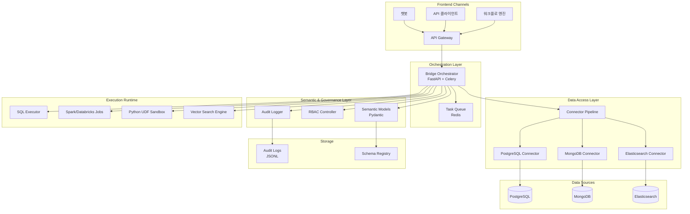
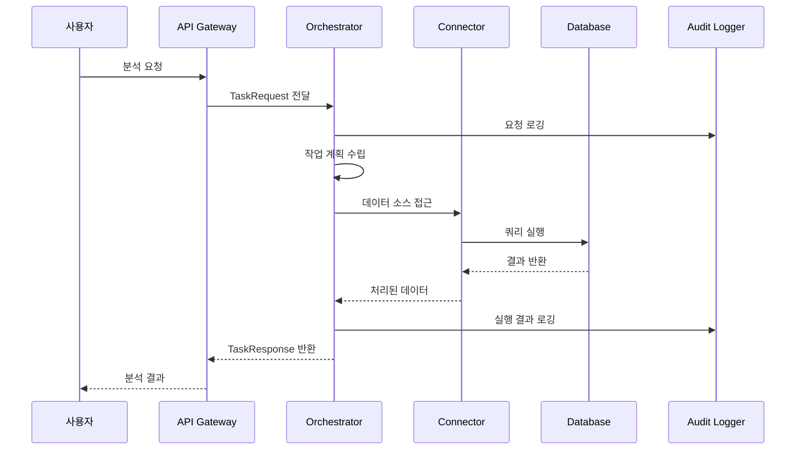
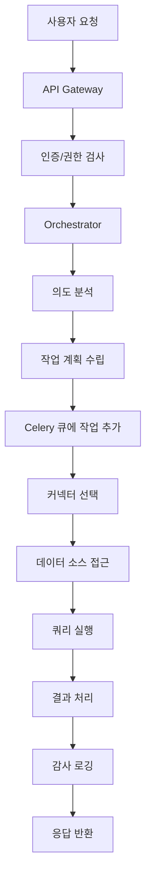

# Bridge 시스템 아키텍처 및 기능 가이드

## 프로젝트 개요

Bridge는 Model Context Protocol(MCP) 기반의 데이터 통합 및 AI 오케스트레이션 시스템입니다. 다양한 데이터 소스(PostgreSQL, MongoDB, Elasticsearch 등)에 대한 표준화된 접근을 제공하고, AI 에이전트가 엔터프라이즈 데이터를 안전하고 투명하게 활용할 수 있도록 지원합니다.

## 시스템 아키텍처

### 전체 시스템 구조



### 컴포넌트 상호작용 다이어그램



## 핵심 컴포넌트

### 1. 커넥터 레이어 (`/src/bridge/connectors/`)

데이터 소스별 표준화된 인터페이스를 제공합니다.

#### BaseConnector (추상 클래스)
```python
class BaseConnector(ABC):
    def test_connection(self) -> bool
    def get_metadata(self) -> Dict[str, Any]
    def run_query(self, query: str, params: Dict[str, Any]) -> Iterable[Dict[str, Any]]
    def mask_columns(self, rows: Iterable[Dict[str, Any]], masked_fields: Iterable[str])
```

#### PostgresConnector (구현체)
- PostgreSQL 데이터베이스 연결 및 쿼리 실행
- 비동기 처리 지원 (asyncpg)
- 스키마 메타데이터 자동 수집
- 민감 데이터 마스킹 기능

#### ConnectorRegistry (커넥터 관리)
- 커넥터 인스턴스의 중앙 관리
- 동적 커넥터 등록 및 조회
- 커넥터별 설정 및 상태 관리

### 2. 오케스트레이터 레이어 (`/src/bridge/orchestrator/`)

사용자 요청을 처리하고 작업을 조율하는 핵심 서비스입니다.

#### CLI 인터페이스 (`cli.py`)
- 명령행 인터페이스를 통한 작업 제출 및 상태 조회
- argparse를 사용한 사용자 친화적 인터페이스
- 실시간 작업 상태 모니터링 및 폴링

#### FastAPI 애플리케이션 (`app.py`)
- RESTful API 엔드포인트 제공
- 헬스 체크 및 상태 모니터링
- 라우터 기반 모듈화된 구조

#### 작업 라우터 (`routers.py`)
- `/tasks/plan` 엔드포인트: 사용자 요청을 작업으로 변환
- 비동기 작업 큐에 실행 요청 전달
- 작업 상태 추적 및 결과 반환

#### Celery 태스크 (`tasks.py`)
- 백그라운드 작업 처리
- 컨텍스트 수집 및 도구 실행
- 확장 가능한 파이프라인 구조

### 3. 시맨틱 레이어 (`/src/bridge/semantic/`)

데이터 구조와 비즈니스 로직을 정의합니다.

#### 데이터 모델 (`models.py`)
- `SemanticEntity`: 데이터 엔터티 정의 (민감도 레벨 포함)
- `TaskRequest`: 사용자 요청 구조
- `TaskResponse`: 작업 응답 구조
- `TaskStep`: 작업 단계별 상세 정보
- `TaskStatusResponse`: 작업 상태 및 결과 조회 응답

### 4. 워크스페이스 관리 (`/src/bridge/workspaces/`)

사용자 권한 및 접근 제어를 담당합니다.

#### RBAC 시스템 (`rbac.py`)
- 역할 기반 접근 제어
- 사용자별 권한 관리
- 동적 권한 검사

### 5. 감사 로깅 (`/src/bridge/audit/`)

시스템 활동을 추적하고 기록합니다.

#### 감사 로거 (`logger.py`)
- 구조화된 JSON 로그 저장
- 타임스탬프 및 메타데이터 포함
- 일별 로그 파일 자동 생성

## 데이터 플로우

### 1. 요청 처리 플로우



### 2. MCP 컨텍스트 패키징


## API 엔드포인트

### 시스템 상태
- `GET /health` - 시스템 상태 확인

### 작업 관리
- `POST /tasks/plan` - 작업 계획 및 실행 요청
- `GET /tasks/{job_id}` - 작업 상태 및 결과 조회

### CLI 인터페이스
- `python cli.py <intent>` - 작업 제출 및 상태 모니터링
- `--sources` - 사용할 데이터 소스 지정
- `--tools` - 필요한 도구 목록 지정
- `--base-url` - 서버 URL 지정
- `--poll-interval` - 상태 조회 간격 조정

#### 요청 예시
```json
{
  "intent": "프리미엄 고객 세그먼트 분석",
  "sources": ["postgres://analytics_db"],
  "required_tools": ["sql_executor", "statistics_analyzer"],
  "context": {
    "time_range": "2024-01-01 to 2024-12-31",
    "customer_tier": "premium"
  }
}
```

#### 응답 예시
```json
{
  "intent": "프리미엄 고객 세그먼트 분석",
  "status": "planned",
  "steps": [
    {
      "name": "collect_context",
      "details": {"sources": ["postgres://analytics_db"]}
    },
    {
      "name": "execute_tools",
      "details": {"tools": ["sql_executor", "statistics_analyzer"]}
    },
    {
      "name": "queue_execution",
      "details": {"job_id": "abc123-def456-ghi789"}
    }
  ]
}
```

#### 작업 상태 조회 응답 예시
```json
{
  "job_id": "abc123-def456-ghi789",
  "state": "SUCCESS",
  "ready": true,
  "successful": true,
  "result": {
    "status": "completed",
    "intent": "프리미엄 고객 세그먼트 분석",
    "collected_sources": [
      {
        "source": "postgres://analytics_db",
        "metadata": {"tables": ["customers", "orders"]}
      }
    ],
    "missing_sources": []
  },
  "error": null
}
```

## 개발 가이드라인

### 1. 새로운 커넥터 추가

```python
from src.bridge.connectors.base import BaseConnector

class NewDatabaseConnector(BaseConnector):
    async def test_connection(self) -> bool:
        # 연결 테스트 로직
        pass
    
    async def get_metadata(self) -> Dict[str, Any]:
        # 메타데이터 수집 로직
        pass
    
    async def run_query(self, query: str, params: Dict[str, Any] = None):
        # 쿼리 실행 로직
        pass
```

### 2. 새로운 시맨틱 모델 추가

```python
from pydantic import BaseModel, Field

class NewSemanticModel(BaseModel):
    name: str
    description: str = Field(default="")
    sensitivity: str = Field(default="internal")
    metadata: Dict[str, Any] = Field(default_factory=dict)
```

### 3. 새로운 API 엔드포인트 추가

```python
from fastapi import APIRouter
from ..semantic.models import TaskRequest, TaskResponse

router = APIRouter()

@router.post("/new-endpoint", response_model=TaskResponse)
async def new_endpoint(request: TaskRequest) -> TaskResponse:
    # 엔드포인트 로직
    pass
```

## 보안 및 거버넌스

### 1. 데이터 마스킹
- 민감한 컬럼 자동 감지 및 마스킹
- 역할별 데이터 접근 제어
- 쿼리 리라이팅을 통한 데이터 보호

### 2. 감사 추적
- 모든 데이터 접근 로깅
- 사용자 행동 추적
- 컴플라이언스 지원

### 3. 접근 제어
- RBAC 기반 권한 관리
- 프로젝트별 데이터 격리
- API 키 기반 인증

## 모니터링 및 관측성

### 1. 로그 관리
- 구조화된 JSON 로그
- 일별 로그 파일 자동 생성
- 중앙화된 로그 수집

### 2. 메트릭 수집
- API 응답 시간
- 쿼리 실행 성능
- 에러율 모니터링

### 3. 알림 시스템
- 시스템 장애 알림
- 성능 임계값 초과 알림
- 보안 이벤트 알림

## 확장성 고려사항

### 1. 수평적 확장
- Celery 워커 노드 추가
- 커넥터 인스턴스 분산
- 캐시 레이어 추가

### 2. 수직적 확장
- 메모리 및 CPU 리소스 증설
- 데이터베이스 연결 풀 최적화
- 비동기 처리 최적화

### 3. 새로운 데이터 소스 지원
- 플러그인 아키텍처
- 커넥터 표준화
- 자동 스키마 감지

## 다음 단계

1. **커넥터 확장**: MongoDB, Elasticsearch 커넥터 구현
2. **AI 통합**: LangChain 및 OpenAI SDK 통합
3. **모니터링 강화**: Prometheus, Grafana 대시보드 구축
4. **테스트 커버리지**: 단위 테스트 및 통합 테스트 확장
5. **문서화**: API 문서 및 사용자 가이드 작성
