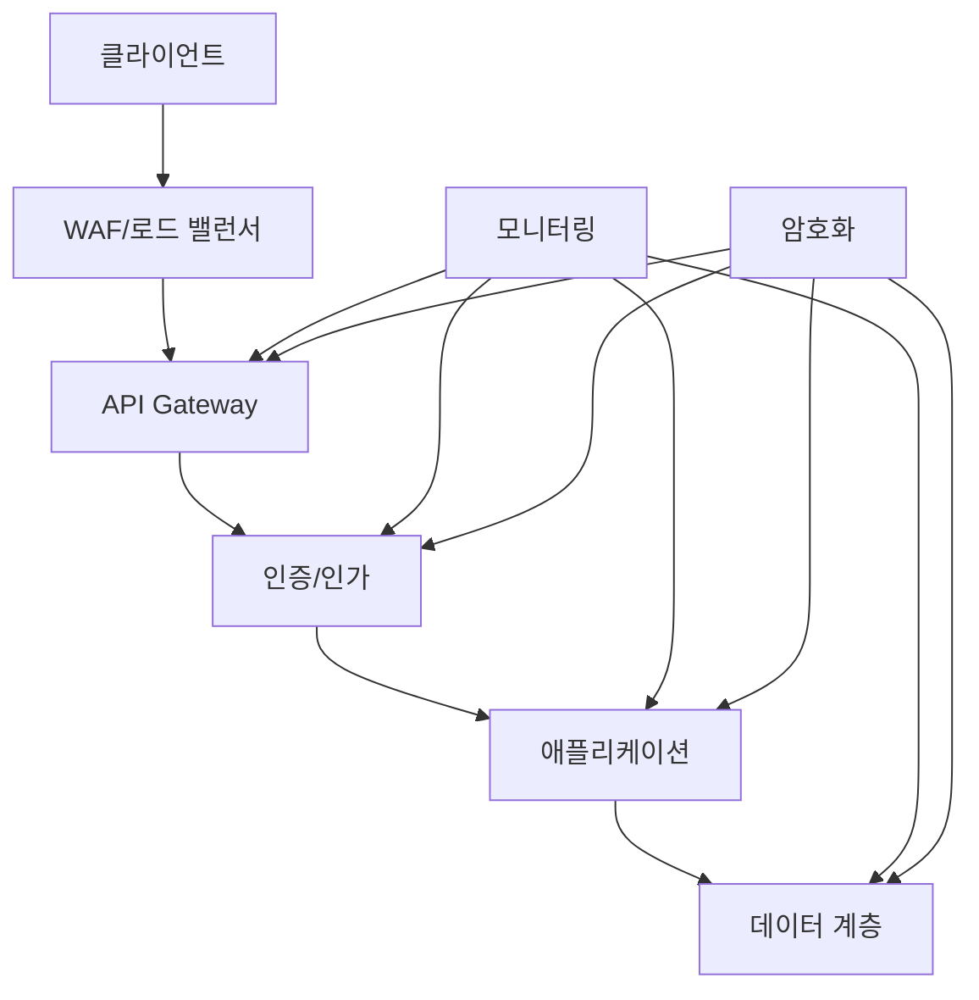

# Bridge 보안 가이드

## 📖 개요

이 문서는 Bridge 시스템의 보안 정책, 구현 방법, 그리고 보안 모범 사례에 대해 설명합니다. 엔터프라이즈 환경에서 데이터 보안과 컴플라이언스를 보장하기 위한 종합적인 보안 가이드입니다.

## 🔒 보안 아키텍처

### 1. 보안 계층 구조



### 2. 보안 컴포넌트

- **WAF (Web Application Firewall)**: SQL 인젝션, XSS 등 웹 공격 차단
- **API Gateway**: 요청 검증, 레이트 리미팅, 인증
- **인증 시스템**: JWT 토큰, OAuth 2.0, SAML
- **권한 관리**: RBAC, ABAC 기반 세밀한 권한 제어
- **암호화**: 전송 중 및 저장 시 데이터 암호화
- **감사 로그**: 모든 보안 이벤트 추적 및 기록

## 🔐 인증 및 인가

### 1. 인증 시스템

#### JWT 토큰 기반 인증

```python
from jose import JWTError, jwt
from datetime import datetime, timedelta
from typing import Optional
import secrets

class AuthenticationService:
    """인증 서비스"""
    
    def __init__(self, secret_key: str, algorithm: str = "HS256"):
        self.secret_key = secret_key
        self.algorithm = algorithm
        self.token_expire_minutes = 30
    
    def create_access_token(self, user_id: str, roles: list) -> str:
        """액세스 토큰 생성"""
        expire = datetime.utcnow() + timedelta(minutes=self.token_expire_minutes)
        to_encode = {
            "sub": user_id,
            "roles": roles,
            "exp": expire,
            "iat": datetime.utcnow(),
            "jti": secrets.token_urlsafe(32)  # JWT ID
        }
        return jwt.encode(to_encode, self.secret_key, algorithm=self.algorithm)
    
    def verify_token(self, token: str) -> Optional[dict]:
        """토큰 검증"""
        try:
            payload = jwt.decode(token, self.secret_key, algorithms=[self.algorithm])
            return payload
        except JWTError:
            return None
    
    def refresh_token(self, token: str) -> Optional[str]:
        """토큰 갱신"""
        payload = self.verify_token(token)
        if payload and payload.get("exp") > datetime.utcnow().timestamp():
            return self.create_access_token(
                payload["sub"], 
                payload.get("roles", [])
            )
        return None
```

#### OAuth 2.0 통합

```python
from authlib.integrations.fastapi_oauth2 import GoogleOAuth2
from fastapi import Depends, HTTPException, status

class OAuthService:
    """OAuth 2.0 서비스"""
    
    def __init__(self, client_id: str, client_secret: str):
        self.google_oauth = GoogleOAuth2(client_id, client_secret)
    
    async def authenticate_google(self, token: str) -> dict:
        """Google OAuth 인증"""
        try:
            user_info = await self.google_oauth.get_user_info(token)
            return {
                "user_id": user_info["id"],
                "email": user_info["email"],
                "name": user_info["name"],
                "provider": "google"
            }
        except Exception as e:
            raise HTTPException(
                status_code=status.HTTP_401_UNAUTHORIZED,
                detail=f"OAuth 인증 실패: {str(e)}"
            )
```

### 2. 권한 관리 시스템

#### RBAC (Role-Based Access Control)

```python
from enum import Enum
from dataclasses import dataclass
from typing import List, Dict, Set

class ResourceType(Enum):
    TABLE = "table"
    DATABASE = "database"
    DASHBOARD = "dashboard"
    REPORT = "report"

class Action(Enum):
    READ = "read"
    WRITE = "write"
    DELETE = "delete"
    EXECUTE = "execute"
    ANALYZE = "analyze"

@dataclass
class Permission:
    """권한 정의"""
    resource_type: ResourceType
    resource_id: str
    actions: Set[Action]
    conditions: Dict[str, Any] = None

@dataclass
class Role:
    """역할 정의"""
    id: str
    name: str
    permissions: List[Permission]
    inherits_from: List[str] = None

class RBACManager:
    """RBAC 관리자"""
    
    def __init__(self):
        self.roles: Dict[str, Role] = {}
        self.user_roles: Dict[str, List[str]] = {}
    
    def create_role(self, role: Role):
        """역할 생성"""
        self.roles[role.id] = role
    
    def assign_role(self, user_id: str, role_id: str):
        """사용자에게 역할 할당"""
        if user_id not in self.user_roles:
            self.user_roles[user_id] = []
        if role_id not in self.user_roles[user_id]:
            self.user_roles[user_id].append(role_id)
    
    def check_permission(self, user_id: str, resource_type: ResourceType, 
                        resource_id: str, action: Action) -> bool:
        """권한 확인"""
        user_roles = self.user_roles.get(user_id, [])
        
        for role_id in user_roles:
            role = self.roles.get(role_id)
            if not role:
                continue
            
            for permission in role.permissions:
                if (permission.resource_type == resource_type and 
                    permission.resource_id == resource_id and 
                    action in permission.actions):
                    return True
        
        return False
```

#### ABAC (Attribute-Based Access Control)

```python
from typing import Dict, Any, List
import json

class ABACPolicy:
    """ABAC 정책"""
    
    def __init__(self, policy_id: str, rules: List[Dict[str, Any]]):
        self.policy_id = policy_id
        self.rules = rules
    
    def evaluate(self, subject: Dict[str, Any], resource: Dict[str, Any], 
                 action: str, environment: Dict[str, Any]) -> bool:
        """정책 평가"""
        context = {
            "subject": subject,
            "resource": resource,
            "action": action,
            "environment": environment
        }
        
        for rule in self.rules:
            if self._evaluate_rule(rule, context):
                return rule.get("effect", "deny") == "allow"
        
        return False
    
    def _evaluate_rule(self, rule: Dict[str, Any], context: Dict[str, Any]) -> bool:
        """규칙 평가"""
        conditions = rule.get("conditions", {})
        
        for attribute, expected_value in conditions.items():
            actual_value = self._get_attribute_value(attribute, context)
            if not self._compare_values(actual_value, expected_value):
                return False
        
        return True
    
    def _get_attribute_value(self, attribute: str, context: Dict[str, Any]) -> Any:
        """속성 값 추출"""
        parts = attribute.split(".")
        value = context
        
        for part in parts:
            if isinstance(value, dict) and part in value:
                value = value[part]
            else:
                return None
        
        return value
    
    def _compare_values(self, actual: Any, expected: Any) -> bool:
        """값 비교"""
        if isinstance(expected, dict):
            operator = expected.get("operator", "equals")
            expected_value = expected.get("value")
            
            if operator == "equals":
                return actual == expected_value
            elif operator == "contains":
                return expected_value in actual
            elif operator == "regex":
                import re
                return bool(re.match(expected_value, str(actual)))
        
        return actual == expected

class ABACManager:
    """ABAC 관리자"""
    
    def __init__(self):
        self.policies: List[ABACPolicy] = []
    
    def add_policy(self, policy: ABACPolicy):
        """정책 추가"""
        self.policies.append(policy)
    
    def evaluate_access(self, subject: Dict[str, Any], resource: Dict[str, Any], 
                       action: str, environment: Dict[str, Any]) -> bool:
        """접근 권한 평가"""
        for policy in self.policies:
            if policy.evaluate(subject, resource, action, environment):
                return True
        return False
```

## 🔐 데이터 보안

### 1. 암호화

#### 전송 중 암호화 (TLS)

```python
from ssl import SSLContext, PROTOCOL_TLSv1_2
import ssl

class TLSConfig:
    """TLS 설정"""
    
    @staticmethod
    def create_ssl_context() -> SSLContext:
        """SSL 컨텍스트 생성"""
        context = ssl.create_default_context(ssl.Purpose.CLIENT_AUTH)
        context.minimum_version = ssl.TLSVersion.TLSv1_2
        context.set_ciphers('ECDHE+AESGCM:ECDHE+CHACHA20:DHE+AESGCM:DHE+CHACHA20:!aNULL:!MD5:!DSS')
        return context
    
    @staticmethod
    def create_client_ssl_context() -> SSLContext:
        """클라이언트 SSL 컨텍스트 생성"""
        context = ssl.create_default_context()
        context.check_hostname = False
        context.verify_mode = ssl.CERT_NONE
        return context
```

#### 저장 시 암호화

```python
from cryptography.fernet import Fernet
from cryptography.hazmat.primitives import hashes
from cryptography.hazmat.primitives.kdf.pbkdf2 import PBKDF2HMAC
import base64
import os

class DataEncryption:
    """데이터 암호화"""
    
    def __init__(self, password: str):
        self.key = self._derive_key(password)
        self.cipher = Fernet(self.key)
    
    def _derive_key(self, password: str) -> bytes:
        """키 파생"""
        salt = os.urandom(16)
        kdf = PBKDF2HMAC(
            algorithm=hashes.SHA256(),
            length=32,
            salt=salt,
            iterations=100000,
        )
        key = base64.urlsafe_b64encode(kdf.derive(password.encode()))
        return key
    
    def encrypt(self, data: str) -> str:
        """데이터 암호화"""
        encrypted_data = self.cipher.encrypt(data.encode())
        return base64.urlsafe_b64encode(encrypted_data).decode()
    
    def decrypt(self, encrypted_data: str) -> str:
        """데이터 복호화"""
        encrypted_bytes = base64.urlsafe_b64decode(encrypted_data.encode())
        decrypted_data = self.cipher.decrypt(encrypted_bytes)
        return decrypted_data.decode()
```

#### 데이터 마스킹

```python
import re
from typing import Any, Dict, List

class DataMasking:
    """데이터 마스킹"""
    
    def __init__(self):
        self.masking_rules = {
            "email": self._mask_email,
            "phone": self._mask_phone,
            "ssn": self._mask_ssn,
            "credit_card": self._mask_credit_card,
            "default": self._mask_default
        }
    
    def mask_data(self, data: Any, field_type: str = "default") -> Any:
        """데이터 마스킹"""
        if isinstance(data, dict):
            return {k: self.mask_data(v, field_type) for k, v in data.items()}
        elif isinstance(data, list):
            return [self.mask_data(item, field_type) for item in data]
        elif isinstance(data, str):
            mask_func = self.masking_rules.get(field_type, self._mask_default)
            return mask_func(data)
        else:
            return data
    
    def _mask_email(self, email: str) -> str:
        """이메일 마스킹"""
        if "@" in email:
            local, domain = email.split("@", 1)
            masked_local = local[0] + "*" * (len(local) - 2) + local[-1] if len(local) > 2 else local[0] + "*"
            return f"{masked_local}@{domain}"
        return email
    
    def _mask_phone(self, phone: str) -> str:
        """전화번호 마스킹"""
        digits = re.sub(r'\D', '', phone)
        if len(digits) >= 10:
            return f"{digits[:3]}-***-{digits[-4:]}"
        return phone
    
    def _mask_ssn(self, ssn: str) -> str:
        """SSN 마스킹"""
        digits = re.sub(r'\D', '', ssn)
        if len(digits) == 9:
            return f"***-**-{digits[-4:]}"
        return ssn
    
    def _mask_credit_card(self, card: str) -> str:
        """신용카드 마스킹"""
        digits = re.sub(r'\D', '', card)
        if len(digits) >= 4:
            return f"****-****-****-{digits[-4:]}"
        return card
    
    def _mask_default(self, data: str) -> str:
        """기본 마스킹"""
        if len(data) <= 2:
            return "*" * len(data)
        return data[0] + "*" * (len(data) - 2) + data[-1]
```

### 2. 데이터 분류 및 라벨링

```python
from enum import Enum
from dataclasses import dataclass
from typing import List, Dict, Any

class DataClassification(Enum):
    PUBLIC = "public"
    INTERNAL = "internal"
    CONFIDENTIAL = "confidential"
    RESTRICTED = "restricted"

class DataSensitivity(Enum):
    LOW = "low"
    MEDIUM = "medium"
    HIGH = "high"
    CRITICAL = "critical"

@dataclass
class DataLabel:
    """데이터 라벨"""
    classification: DataClassification
    sensitivity: DataSensitivity
    tags: List[str]
    retention_period: int  # 일 단위
    encryption_required: bool = True

class DataClassificationManager:
    """데이터 분류 관리자"""
    
    def __init__(self):
        self.classification_rules: Dict[str, DataLabel] = {}
    
    def add_classification_rule(self, pattern: str, label: DataLabel):
        """분류 규칙 추가"""
        self.classification_rules[pattern] = label
    
    def classify_data(self, field_name: str, data_type: str, 
                     sample_data: Any = None) -> DataLabel:
        """데이터 분류"""
        # 패턴 매칭으로 분류
        for pattern, label in self.classification_rules.items():
            if re.match(pattern, field_name, re.IGNORECASE):
                return label
        
        # 기본 분류
        if any(keyword in field_name.lower() for keyword in ['email', 'phone', 'ssn']):
            return DataLabel(
                classification=DataClassification.CONFIDENTIAL,
                sensitivity=DataSensitivity.HIGH,
                tags=['pii'],
                retention_period=2555,  # 7년
                encryption_required=True
            )
        
        return DataLabel(
            classification=DataClassification.INTERNAL,
            sensitivity=DataSensitivity.MEDIUM,
            tags=[],
            retention_period=365,  # 1년
            encryption_required=False
        )
```

## 🛡️ 입력 검증 및 보안

### 1. SQL 인젝션 방지

```python
from sqlalchemy import text
from typing import Dict, Any, List

class SecureQueryExecutor:
    """보안 쿼리 실행기"""
    
    def __init__(self, connection):
        self.connection = connection
    
    async def execute_secure_query(self, query: str, params: Dict[str, Any] = None) -> List[Dict[str, Any]]:
        """보안 쿼리 실행"""
        # 쿼리 검증
        if not self._validate_query(query):
            raise ValueError("잘못된 쿼리 형식")
        
        # 파라미터 검증
        if params:
            params = self._sanitize_params(params)
        
        # 파라미터 바인딩으로 실행
        try:
            result = await self.connection.execute(text(query), params or {})
            return [dict(row) for row in result]
        except Exception as e:
            raise ValueError(f"쿼리 실행 오류: {str(e)}")
    
    def _validate_query(self, query: str) -> bool:
        """쿼리 검증"""
        # 허용된 키워드만 사용
        allowed_keywords = ['SELECT', 'FROM', 'WHERE', 'ORDER BY', 'GROUP BY', 'HAVING', 'LIMIT']
        query_upper = query.upper()
        
        # 위험한 키워드 차단
        dangerous_keywords = ['DROP', 'DELETE', 'UPDATE', 'INSERT', 'ALTER', 'CREATE', 'EXEC', 'EXECUTE']
        for keyword in dangerous_keywords:
            if keyword in query_upper:
                return False
        
        return True
    
    def _sanitize_params(self, params: Dict[str, Any]) -> Dict[str, Any]:
        """파라미터 정화"""
        sanitized = {}
        for key, value in params.items():
            if isinstance(value, str):
                # SQL 특수 문자 이스케이프
                sanitized[key] = value.replace("'", "''").replace("\\", "\\\\")
            else:
                sanitized[key] = value
        return sanitized
```

### 2. XSS 방지

```python
import html
import re
from typing import Any

class XSSProtection:
    """XSS 보호"""
    
    def __init__(self):
        self.dangerous_patterns = [
            r'<script.*?>.*?</script>',
            r'javascript:',
            r'on\w+\s*=',
            r'<iframe.*?>',
            r'<object.*?>',
            r'<embed.*?>'
        ]
    
    def sanitize_input(self, data: Any) -> Any:
        """입력 데이터 정화"""
        if isinstance(data, str):
            return self._sanitize_string(data)
        elif isinstance(data, dict):
            return {k: self.sanitize_input(v) for k, v in data.items()}
        elif isinstance(data, list):
            return [self.sanitize_input(item) for item in data]
        else:
            return data
    
    def _sanitize_string(self, text: str) -> str:
        """문자열 정화"""
        # HTML 엔티티 인코딩
        sanitized = html.escape(text)
        
        # 위험한 패턴 제거
        for pattern in self.dangerous_patterns:
            sanitized = re.sub(pattern, '', sanitized, flags=re.IGNORECASE | re.DOTALL)
        
        return sanitized
    
    def validate_output(self, data: str) -> bool:
        """출력 데이터 검증"""
        for pattern in self.dangerous_patterns:
            if re.search(pattern, data, re.IGNORECASE | re.DOTALL):
                return False
        return True
```

### 3. CSRF 보호

```python
import secrets
from typing import Dict, Optional
from fastapi import Request, HTTPException, status

class CSRFProtection:
    """CSRF 보호"""
    
    def __init__(self):
        self.tokens: Dict[str, str] = {}
        self.token_expiry = 3600  # 1시간
    
    def generate_token(self, user_id: str) -> str:
        """CSRF 토큰 생성"""
        token = secrets.token_urlsafe(32)
        self.tokens[user_id] = token
        return token
    
    def validate_token(self, user_id: str, token: str) -> bool:
        """CSRF 토큰 검증"""
        stored_token = self.tokens.get(user_id)
        if not stored_token:
            return False
        
        return secrets.compare_digest(stored_token, token)
    
    def get_csrf_token_from_request(self, request: Request) -> Optional[str]:
        """요청에서 CSRF 토큰 추출"""
        # 헤더에서 토큰 추출
        token = request.headers.get("X-CSRF-Token")
        if token:
            return token
        
        # 폼 데이터에서 토큰 추출
        if hasattr(request, 'form'):
            return request.form.get("csrf_token")
        
        return None
    
    def validate_request(self, request: Request, user_id: str) -> bool:
        """요청 CSRF 검증"""
        if request.method in ['GET', 'HEAD', 'OPTIONS']:
            return True
        
        token = self.get_csrf_token_from_request(request)
        if not token:
            return False
        
        return self.validate_token(user_id, token)
```

## 📊 감사 및 모니터링

### 1. 감사 로그 시스템

```python
from datetime import datetime
from typing import Dict, Any, List
import json
import hashlib

class AuditLogger:
    """감사 로거"""
    
    def __init__(self, log_file: str = "logs/audit/audit.log"):
        self.log_file = log_file
        self.logger = self._setup_logger()
    
    def _setup_logger(self):
        """로거 설정"""
        import logging
        logger = logging.getLogger("audit")
        logger.setLevel(logging.INFO)
        
        handler = logging.FileHandler(self.log_file)
        formatter = logging.Formatter('%(message)s')
        handler.setFormatter(formatter)
        logger.addHandler(handler)
        
        return logger
    
    def log_event(self, event_type: str, user_id: str, resource: str, 
                  action: str, details: Dict[str, Any] = None):
        """이벤트 로깅"""
        event = {
            "timestamp": datetime.utcnow().isoformat(),
            "event_type": event_type,
            "user_id": user_id,
            "resource": resource,
            "action": action,
            "details": details or {},
            "event_id": self._generate_event_id()
        }
        
        # 무결성 검증을 위한 해시
        event["integrity_hash"] = self._calculate_hash(event)
        
        self.logger.info(json.dumps(event))
    
    def _generate_event_id(self) -> str:
        """이벤트 ID 생성"""
        return secrets.token_urlsafe(16)
    
    def _calculate_hash(self, event: Dict[str, Any]) -> str:
        """이벤트 해시 계산"""
        event_str = json.dumps(event, sort_keys=True)
        return hashlib.sha256(event_str.encode()).hexdigest()
    
    def verify_integrity(self, event: Dict[str, Any]) -> bool:
        """이벤트 무결성 검증"""
        stored_hash = event.pop("integrity_hash", "")
        calculated_hash = self._calculate_hash(event)
        return secrets.compare_digest(stored_hash, calculated_hash)
```

### 2. 보안 모니터링

```python
from typing import Dict, Any, List
from collections import defaultdict, deque
import time

class SecurityMonitor:
    """보안 모니터"""
    
    def __init__(self):
        self.failed_attempts = defaultdict(list)
        self.suspicious_activities = deque(maxlen=1000)
        self.alert_thresholds = {
            "failed_login": 5,  # 5회 실패 시 알림
            "suspicious_query": 3,  # 3회 의심스러운 쿼리 시 알림
            "data_access_anomaly": 10  # 10회 이상 비정상 데이터 접근 시 알림
        }
    
    def track_failed_login(self, user_id: str, ip_address: str):
        """실패한 로그인 추적"""
        current_time = time.time()
        self.failed_attempts[user_id].append({
            "timestamp": current_time,
            "ip_address": ip_address
        })
        
        # 1시간 이내 실패 횟수 확인
        recent_failures = [
            attempt for attempt in self.failed_attempts[user_id]
            if current_time - attempt["timestamp"] < 3600
        ]
        
        if len(recent_failures) >= self.alert_thresholds["failed_login"]:
            self._trigger_alert("failed_login", {
                "user_id": user_id,
                "ip_address": ip_address,
                "failure_count": len(recent_failures)
            })
    
    def track_suspicious_query(self, user_id: str, query: str, ip_address: str):
        """의심스러운 쿼리 추적"""
        suspicious_patterns = [
            "union select",
            "drop table",
            "delete from",
            "update set",
            "insert into"
        ]
        
        query_lower = query.lower()
        for pattern in suspicious_patterns:
            if pattern in query_lower:
                self.suspicious_activities.append({
                    "timestamp": time.time(),
                    "user_id": user_id,
                    "query": query,
                    "ip_address": ip_address,
                    "pattern": pattern
                })
                
                # 최근 의심스러운 활동 확인
                recent_activities = [
                    activity for activity in self.suspicious_activities
                    if time.time() - activity["timestamp"] < 3600
                ]
                
                if len(recent_activities) >= self.alert_thresholds["suspicious_query"]:
                    self._trigger_alert("suspicious_query", {
                        "user_id": user_id,
                        "ip_address": ip_address,
                        "activity_count": len(recent_activities)
                    })
                break
    
    def track_data_access(self, user_id: str, resource: str, action: str, 
                         data_classification: str):
        """데이터 접근 추적"""
        # 민감한 데이터 접근 모니터링
        if data_classification in ["confidential", "restricted"]:
            self.suspicious_activities.append({
                "timestamp": time.time(),
                "user_id": user_id,
                "resource": resource,
                "action": action,
                "classification": data_classification,
                "type": "sensitive_data_access"
            })
    
    def _trigger_alert(self, alert_type: str, details: Dict[str, Any]):
        """보안 알림 트리거"""
        alert = {
            "timestamp": time.time(),
            "alert_type": alert_type,
            "details": details,
            "severity": self._get_alert_severity(alert_type)
        }
        
        # 알림 전송 (이메일, 슬랙 등)
        self._send_alert(alert)
    
    def _get_alert_severity(self, alert_type: str) -> str:
        """알림 심각도 결정"""
        severity_map = {
            "failed_login": "medium",
            "suspicious_query": "high",
            "data_access_anomaly": "critical"
        }
        return severity_map.get(alert_type, "low")
    
    def _send_alert(self, alert: Dict[str, Any]):
        """알림 전송"""
        # 실제 구현에서는 이메일, 슬랙, SMS 등으로 전송
        print(f"SECURITY ALERT: {alert}")
```

## 🔧 보안 설정

### 1. 환경 변수 보안

```python
import os
from typing import Optional
from cryptography.fernet import Fernet

class SecureConfig:
    """보안 설정 관리"""
    
    def __init__(self):
        self.encryption_key = self._get_or_create_encryption_key()
        self.cipher = Fernet(self.encryption_key)
    
    def _get_or_create_encryption_key(self) -> bytes:
        """암호화 키 생성 또는 조회"""
        key_file = "config/encryption.key"
        
        if os.path.exists(key_file):
            with open(key_file, "rb") as f:
                return f.read()
        else:
            key = Fernet.generate_key()
            os.makedirs(os.path.dirname(key_file), exist_ok=True)
            with open(key_file, "wb") as f:
                f.write(key)
            return key
    
    def get_secure_config(self, key: str, default: Optional[str] = None) -> Optional[str]:
        """보안 설정 조회"""
        value = os.getenv(key, default)
        if value and value.startswith("encrypted:"):
            encrypted_value = value[10:]  # "encrypted:" 제거
            return self.cipher.decrypt(encrypted_value.encode()).decode()
        return value
    
    def set_secure_config(self, key: str, value: str, encrypt: bool = True):
        """보안 설정 저장"""
        if encrypt:
            encrypted_value = self.cipher.encrypt(value.encode())
            os.environ[key] = f"encrypted:{encrypted_value.decode()}"
        else:
            os.environ[key] = value
```

### 2. 보안 헤더 설정

```python
from fastapi import FastAPI
from fastapi.middleware.trustedhost import TrustedHostMiddleware
from fastapi.middleware.httpsredirect import HTTPSRedirectMiddleware

def setup_security_headers(app: FastAPI):
    """보안 헤더 설정"""
    
    @app.middleware("http")
    async def add_security_headers(request, call_next):
        response = await call_next(request)
        
        # 보안 헤더 추가
        response.headers["X-Content-Type-Options"] = "nosniff"
        response.headers["X-Frame-Options"] = "DENY"
        response.headers["X-XSS-Protection"] = "1; mode=block"
        response.headers["Strict-Transport-Security"] = "max-age=31536000; includeSubDomains"
        response.headers["Referrer-Policy"] = "strict-origin-when-cross-origin"
        response.headers["Content-Security-Policy"] = "default-src 'self'"
        
        return response
    
    # HTTPS 리다이렉션
    app.add_middleware(HTTPSRedirectMiddleware)
    
    # 신뢰할 수 있는 호스트 설정
    app.add_middleware(TrustedHostMiddleware, allowed_hosts=["*.example.com"])
```

## 🚨 보안 사고 대응

### 1. 침입 탐지 시스템

```python
from typing import Dict, Any, List
import time
from collections import defaultdict

class IntrusionDetectionSystem:
    """침입 탐지 시스템"""
    
    def __init__(self):
        self.attack_patterns = {
            "sql_injection": [
                r"union\s+select",
                r"drop\s+table",
                r"delete\s+from",
                r"'\s*or\s*'1'\s*=\s*'1"
            ],
            "xss": [
                r"<script.*?>.*?</script>",
                r"javascript:",
                r"on\w+\s*="
            ],
            "path_traversal": [
                r"\.\./",
                r"\.\.\\",
                r"%2e%2e%2f",
                r"%2e%2e%5c"
            ]
        }
        self.blocked_ips = set()
        self.suspicious_ips = defaultdict(list)
    
    def analyze_request(self, request_data: Dict[str, Any]) -> Dict[str, Any]:
        """요청 분석"""
        ip_address = request_data.get("ip_address")
        user_agent = request_data.get("user_agent", "")
        query = request_data.get("query", "")
        path = request_data.get("path", "")
        
        threats = []
        
        # SQL 인젝션 탐지
        if self._detect_sql_injection(query):
            threats.append("sql_injection")
        
        # XSS 탐지
        if self._detect_xss(query + path + user_agent):
            threats.append("xss")
        
        # 경로 탐색 탐지
        if self._detect_path_traversal(path):
            threats.append("path_traversal")
        
        # 의심스러운 활동 기록
        if threats:
            self.suspicious_ips[ip_address].append({
                "timestamp": time.time(),
                "threats": threats,
                "request_data": request_data
            })
        
        return {
            "is_threat": len(threats) > 0,
            "threats": threats,
            "risk_level": self._calculate_risk_level(threats),
            "action": self._determine_action(ip_address, threats)
        }
    
    def _detect_sql_injection(self, query: str) -> bool:
        """SQL 인젝션 탐지"""
        query_lower = query.lower()
        for pattern in self.attack_patterns["sql_injection"]:
            if re.search(pattern, query_lower, re.IGNORECASE):
                return True
        return False
    
    def _detect_xss(self, text: str) -> bool:
        """XSS 탐지"""
        for pattern in self.attack_patterns["xss"]:
            if re.search(pattern, text, re.IGNORECASE | re.DOTALL):
                return True
        return False
    
    def _detect_path_traversal(self, path: str) -> bool:
        """경로 탐색 탐지"""
        for pattern in self.attack_patterns["path_traversal"]:
            if re.search(pattern, path, re.IGNORECASE):
                return True
        return False
    
    def _calculate_risk_level(self, threats: List[str]) -> str:
        """위험 수준 계산"""
        if len(threats) >= 3:
            return "critical"
        elif len(threats) >= 2:
            return "high"
        elif len(threats) >= 1:
            return "medium"
        else:
            return "low"
    
    def _determine_action(self, ip_address: str, threats: List[str]) -> str:
        """대응 조치 결정"""
        if len(threats) >= 3:
            self.blocked_ips.add(ip_address)
            return "block"
        elif len(threats) >= 2:
            return "rate_limit"
        elif len(threats) >= 1:
            return "monitor"
        else:
            return "allow"
```

### 2. 자동 대응 시스템

```python
class AutomatedResponseSystem:
    """자동 대응 시스템"""
    
    def __init__(self):
        self.response_actions = {
            "block": self._block_ip,
            "rate_limit": self._rate_limit_ip,
            "monitor": self._monitor_ip,
            "alert": self._send_alert
        }
    
    def handle_threat(self, threat_analysis: Dict[str, Any]):
        """위협 대응"""
        action = threat_analysis.get("action")
        ip_address = threat_analysis.get("ip_address")
        
        if action in self.response_actions:
            self.response_actions[action](ip_address, threat_analysis)
    
    def _block_ip(self, ip_address: str, threat_analysis: Dict[str, Any]):
        """IP 차단"""
        # 방화벽 규칙 추가
        print(f"Blocking IP: {ip_address}")
        # 실제 구현에서는 iptables, AWS Security Groups 등 사용
    
    def _rate_limit_ip(self, ip_address: str, threat_analysis: Dict[str, Any]):
        """IP 속도 제한"""
        # 속도 제한 규칙 추가
        print(f"Rate limiting IP: {ip_address}")
    
    def _monitor_ip(self, ip_address: str, threat_analysis: Dict[str, Any]):
        """IP 모니터링 강화"""
        # 모니터링 레벨 증가
        print(f"Enhanced monitoring for IP: {ip_address}")
    
    def _send_alert(self, ip_address: str, threat_analysis: Dict[str, Any]):
        """보안 알림 전송"""
        # 관리자에게 알림 전송
        print(f"Security alert for IP: {ip_address}")
```

## 📋 보안 체크리스트

### 1. 개발 단계

- [ ] 입력 검증 및 정화 구현
- [ ] SQL 인젝션 방지 (파라미터 바인딩)
- [ ] XSS 방지 (출력 인코딩)
- [ ] CSRF 보호 토큰 구현
- [ ] 인증 및 권한 검사
- [ ] 암호화 구현 (전송/저장)
- [ ] 로깅 및 모니터링

### 2. 배포 단계

- [ ] HTTPS 강제 사용
- [ ] 보안 헤더 설정
- [ ] 방화벽 규칙 구성
- [ ] 침입 탐지 시스템 설정
- [ ] 로그 모니터링 설정
- [ ] 백업 및 복구 계획
- [ ] 보안 업데이트 정책

### 3. 운영 단계

- [ ] 정기적 보안 스캔
- [ ] 취약점 평가
- [ ] 침투 테스트
- [ ] 보안 교육
- [ ] 사고 대응 계획
- [ ] 컴플라이언스 검토

이 보안 가이드는 Bridge 시스템의 보안을 보장하기 위한 종합적인 접근 방법을 제시합니다. 보안은 지속적인 프로세스이므로 정기적으로 검토하고 업데이트해야 합니다.
